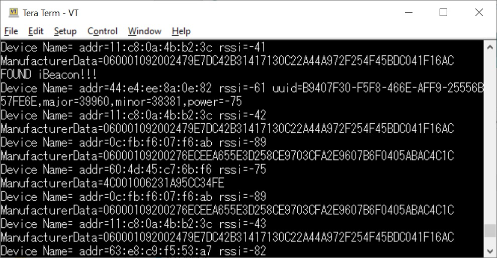

###M5StackでBLEのAdvertizing packetを表示する
M5Stackを使って、周辺に流れているBLEのAdvertizing packetをキャプチャし、シリアルターミナルに表示していく。
シリアルターミナルのボーレートは115200bps。

PCのシリアルターミナルに、M5StackのTypeC USBケーブルを接続。
TypeC USBコネクタはESP32のUART0につながっている。

##プログラムの仕様

#Setup()関数
ESP32のUART0のボーレートを115200bpsに設定。
M5StackのLCD画面背景をNavy色にし、白い文字で"START"と表示する。
（ただしこの画面設定は、次のloop()関数によりすぐに上書きされるので、実際は見えない。）

#loop()関数
Setup関数による処理が終わったらこちらの関数が実行される。
1) M5StackのLCD画面背景を黄色にし、黒い文字で"Scan start!"と表示する。
2) BLE初期化する。
3) BLEでのAdvertizing packetのスキャンを開始する。
　スキャンは、scanTime　で定義された時間分、継続する。
4) scanTime　で定義された時間が経過したら、スキャンを終了する。

#BLEAdvertisedDeviceCallbacks()関数
Advertizing packetが検出されたら呼ばれる関数。
この中で、iBeaconをかどうかをチェックしたり、データ内容をUART経由でシリアルターミナルに表示したりしている。

